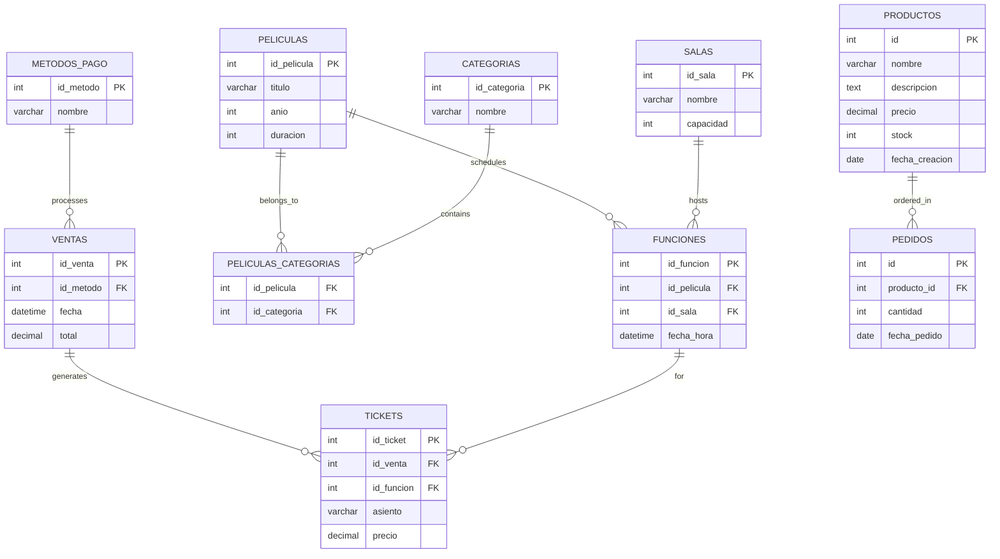

# Database Schema Documentation

This document provides comprehensive documentation of the Laboratorio Clínico Glorimar database schema, including table structures, relationships, indexes, and data constraints.

## Table of Contents

- [Overview](#overview)
- [Core Tables](#core-tables)
- [Relationship Tables](#relationship-tables)
- [Transaction Tables](#transaction-tables)
- [Extended Tables](#extended-tables)
- [Indexes and Constraints](#indexes-and-constraints)
- [Data Types and Constraints](#data-types-and-constraints)
- [Sample Data](#sample-data)
- [ER Diagram](#er-diagram)

## Overview

The Cine Glorimar database uses MariaDB/MySQL and follows a normalized relational structure optimized for cinema management operations.

### Database Name
- **cine**

### Character Set
- **utf8mb4** (Unicode support)

### Collation
- **utf8mb4_general_ci**

## Core Tables

### 1. peliculas (Experiments/Exams)

**Purpose:** Stores information about medical experiments/exams.

```sql
CREATE TABLE `peliculas` (
  `id_pelicula` int(11) NOT NULL,
  `titulo` varchar(255) NOT NULL,
  `anio` int(11) DEFAULT NULL,
  `duracion` int(11) DEFAULT NULL
) ENGINE=InnoDB DEFAULT CHARSET=utf8mb4 COLLATE=utf8mb4_general_ci;
```

**Columns:**
- `id_pelicula`: Primary key, auto-increment
- `titulo`: Movie title (required, max 255 chars)
- `anio`: Release year (optional)
- `duracion`: Duration in minutes (optional)

**Constraints:**
- PRIMARY KEY (`id_pelicula`)
- UNIQUE KEY on `titulo` (implied by business logic)

### 2. salas (Theaters)

**Purpose:** Defines screening rooms/theaters in the cinema.

```sql
CREATE TABLE `salas` (
  `id_sala` int(11) NOT NULL,
  `nombre` varchar(100) NOT NULL,
  `capacidad` int(11) NOT NULL
) ENGINE=InnoDB DEFAULT CHARSET=utf8mb4 COLLATE=utf8mb4_general_ci;
```

**Columns:**
- `id_sala`: Primary key, auto-increment
- `nombre`: Theater name (required, max 100 chars)
- `capacidad`: Maximum seating capacity (required, positive integer)

**Constraints:**
- PRIMARY KEY (`id_sala`)
- CHECK (`capacidad` > 0)

### 3. funciones (Showtimes)

**Purpose:** Schedules movie screenings in specific theaters.

```sql
CREATE TABLE `funciones` (
  `id_funcion` int(11) NOT NULL,
  `id_pelicula` int(11) DEFAULT NULL,
  `id_sala` int(11) DEFAULT NULL,
  `fecha_hora` datetime DEFAULT NULL
) ENGINE=InnoDB DEFAULT CHARSET=utf8mb4 COLLATE=utf8mb4_general_ci;
```

**Columns:**
- `id_funcion`: Primary key, auto-increment
- `id_pelicula`: Foreign key to peliculas table
- `id_sala`: Foreign key to salas table
- `fecha_hora`: Screening date and time

**Constraints:**
- PRIMARY KEY (`id_funcion`)
- FOREIGN KEY (`id_pelicula`) REFERENCES `peliculas`(`id_pelicula`)
- FOREIGN KEY (`id_sala`) REFERENCES `salas`(`id_sala`)
- INDEX on `id_pelicula`, `id_sala`

### 4. metodos_pago (Payment Methods)

**Purpose:** Defines available payment methods for transactions.

```sql
CREATE TABLE `metodos_pago` (
  `id_metodo` int(11) NOT NULL,
  `nombre` varchar(100) NOT NULL
) ENGINE=InnoDB DEFAULT CHARSET=utf8mb4 COLLATE=utf8mb4_general_ci;
```

**Columns:**
- `id_metodo`: Primary key, auto-increment
- `nombre`: Payment method name (required, max 100 chars)

**Constraints:**
- PRIMARY KEY (`id_metodo`)

## Relationship Tables

### 5. categorias (Categories)

**Purpose:** Movie genre/action categories.

```sql
CREATE TABLE `categorias` (
  `id_categoria` int(11) NOT NULL,
  `nombre` varchar(100) NOT NULL
) ENGINE=InnoDB DEFAULT CHARSET=utf8mb4 COLLATE=utf8mb4_general_ci;
```

**Columns:**
- `id_categoria`: Primary key, auto-increment
- `nombre`: Category name (required, max 100 chars)

### 6. peliculas_categorias (Movie-Category Relationships)

**Purpose:** Many-to-many relationship between movies and categories.

```sql
CREATE TABLE `peliculas_categorias` (
  `id_pelicula` int(11) NOT NULL,
  `id_categoria` int(11) NOT NULL
) ENGINE=InnoDB DEFAULT CHARSET=utf8mb4 COLLATE=utf8mb4_general_ci;
```

**Columns:**
- `id_pelicula`: Foreign key to peliculas
- `id_categoria`: Foreign key to categorias

**Constraints:**
- PRIMARY KEY (`id_pelicula`, `id_categoria`)
- FOREIGN KEY (`id_pelicula`) REFERENCES `peliculas`(`id_pelicula`) ON DELETE CASCADE
- FOREIGN KEY (`id_categoria`) REFERENCES `categorias`(`id_categoria`)

## Transaction Tables

### 7. ventas (Sales)

**Purpose:** Records ticket sales transactions.

```sql
CREATE TABLE `ventas` (
  `id_venta` int(11) NOT NULL,
  `id_metodo` int(11) DEFAULT NULL,
  `fecha` datetime DEFAULT NULL,
  `total` decimal(10,2) DEFAULT NULL
) ENGINE=InnoDB DEFAULT CHARSET=utf8mb4 COLLATE=utf8mb4_general_ci;
```

**Columns:**
- `id_venta`: Primary key, auto-increment
- `id_metodo`: Foreign key to metodos_pago
- `fecha`: Sale date and time
- `total`: Total amount (decimal, 2 decimal places)

**Constraints:**
- PRIMARY KEY (`id_venta`)
- FOREIGN KEY (`id_metodo`) REFERENCES `metodos_pago`(`id_metodo`)

### 8. tickets (Tickets)

**Purpose:** Individual ticket records for each sale.

```sql
CREATE TABLE `tickets` (
  `id_ticket` int(11) NOT NULL,
  `id_venta` int(11) DEFAULT NULL,
  `id_funcion` int(11) DEFAULT NULL,
  `asiento` varchar(10) DEFAULT NULL,
  `precio` decimal(10,2) DEFAULT NULL
) ENGINE=InnoDB DEFAULT CHARSET=utf8mb4 COLLATE=utf8mb4_general_ci;
```

**Columns:**
- `id_ticket`: Primary key, auto-increment
- `id_venta`: Foreign key to ventas
- `id_funcion`: Foreign key to funciones
- `asiento`: Seat identifier (e.g., "A1", "B12")
- `precio`: Individual ticket price

**Constraints:**
- PRIMARY KEY (`id_ticket`)
- FOREIGN KEY (`id_venta`) REFERENCES `ventas`(`id_venta`)
- FOREIGN KEY (`id_funcion`) REFERENCES `funciones`(`id_funcion`)

## Extended Tables

### 9. productos (Products)

**Purpose:** Concession stand products (extended functionality).

```sql
CREATE TABLE `productos` (
  `id` int(11) NOT NULL AUTO_INCREMENT,
  `nombre` varchar(255) NOT NULL,
  `descripcion` text,
  `precio` decimal(10,2) NOT NULL,
  `stock` int(11) NOT NULL DEFAULT 0,
  `fecha_creacion` date DEFAULT NULL,
  PRIMARY KEY (`id`)
) ENGINE=InnoDB DEFAULT CHARSET=utf8mb4;
```

**Columns:**
- `id`: Primary key, auto-increment
- `nombre`: Product name
- `descripcion`: Product description
- `precio`: Unit price
- `stock`: Current stock quantity
- `fecha_creacion`: Creation date

### 10. pedidos (Orders)

**Purpose:** Customer orders for products (extended functionality).

```sql
CREATE TABLE `pedidos` (
  `id` int(11) NOT NULL AUTO_INCREMENT,
  `producto_id` int(11) NOT NULL,
  `cantidad` int(11) NOT NULL,
  `fecha_pedido` date DEFAULT NULL,
  PRIMARY KEY (`id`),
  KEY `producto_id` (`producto_id`),
  CONSTRAINT `pedidos_ibfk_1` FOREIGN KEY (`producto_id`) REFERENCES `productos` (`id`)
) ENGINE=InnoDB DEFAULT CHARSET=utf8mb4;
```

**Columns:**
- `id`: Primary key, auto-increment
- `producto_id`: Foreign key to productos
- `cantidad`: Quantity ordered
- `fecha_pedido`: Order date

## Indexes and Constraints

### Primary Keys
- All tables have auto-incrementing integer primary keys
- Composite primary key on `peliculas_categorias` (id_pelicula, id_categoria)

### Foreign Keys
- `funciones.id_pelicula` → `peliculas.id_pelicula`
- `funciones.id_sala` → `salas.id_sala`
- `ventas.id_metodo` → `metodos_pago.id_metodo`
- `tickets.id_venta` → `ventas.id_venta`
- `tickets.id_funcion` → `funciones.id_funcion`
- `peliculas_categorias.id_pelicula` → `peliculas.id_pelicula` (CASCADE)
- `peliculas_categorias.id_categoria` → `categorias.id_categoria`
- `pedidos.producto_id` → `productos.id`

### Indexes
```sql
-- Performance indexes
CREATE INDEX idx_funciones_fecha ON funciones(fecha_hora);
CREATE INDEX idx_funciones_pelicula ON funciones(id_pelicula);
CREATE INDEX idx_funciones_sala ON funciones(id_sala);
CREATE INDEX idx_ventas_fecha ON ventas(fecha);
CREATE INDEX idx_tickets_funcion ON tickets(id_funcion);
CREATE INDEX idx_peliculas_titulo ON peliculas(titulo);
```

## Data Types and Constraints

### Numeric Types
- **INT(11)**: Standard integers for IDs and counts
- **DECIMAL(10,2)**: Monetary values with 2 decimal places
- **YEAR**: Four-digit year values

### String Types
- **VARCHAR(255)**: Movie titles, product names
- **VARCHAR(100)**: Names, categories, payment methods
- **VARCHAR(10)**: Seat identifiers
- **TEXT**: Long descriptions

### Date/Time Types
- **DATETIME**: Full date and time with seconds
- **DATE**: Date only (for creation/order dates)

### Constraints
- **NOT NULL**: Required fields
- **DEFAULT**: Default values where applicable
- **AUTO_INCREMENT**: Automatic ID generation
- **UNSIGNED**: Positive numbers only where applicable

## Sample Data

### Categories
```sql
INSERT INTO `categorias` (`id_categoria`, `nombre`) VALUES
(1, 'Acción'),
(2, 'Ciencia Ficción'),
(3, 'Drama'),
(4, 'Comedia'),
(5, 'Aventura');
```

### Movies
```sql
INSERT INTO `peliculas` (`id_pelicula`, `titulo`, `anio`, `duracion`) VALUES
(1, 'Avengers: Endgame', 2019, 181),
(2, 'Interstellar', 2014, 169),
(3, 'The Shawshank Redemption', 1994, 142),
(4, 'Deadpool', 2016, 108),
(5, 'Jurassic Park', 1993, 127);
```

### Theaters
```sql
INSERT INTO `salas` (`id_sala`, `nombre`, `capacidad`) VALUES
(1, 'Sala IMAX', 200),
(2, 'Sala VIP', 100),
(3, 'Sala 3D', 150),
(4, 'Sala Estándar', 120);
```

### Payment Methods
```sql
INSERT INTO `metodos_pago` (`id_metodo`, `nombre`) VALUES
(1, 'Transferencia Bancaria'),
(2, 'Tarjeta de Crédito'),
(3, 'Efectivo');
```

## ER Diagram



## Performance Considerations

### Query Optimization
- Indexes on frequently queried columns
- Composite indexes for complex queries
- Foreign key constraints for data integrity

### Data Integrity
- Cascading deletes where appropriate
- Referential integrity constraints
- Check constraints for data validation

### Scalability
- Auto-incrementing primary keys
- Normalized structure to reduce redundancy
- Efficient indexing strategy

---

**Last updated:** January 2025
**Database Version:** 1.0.0